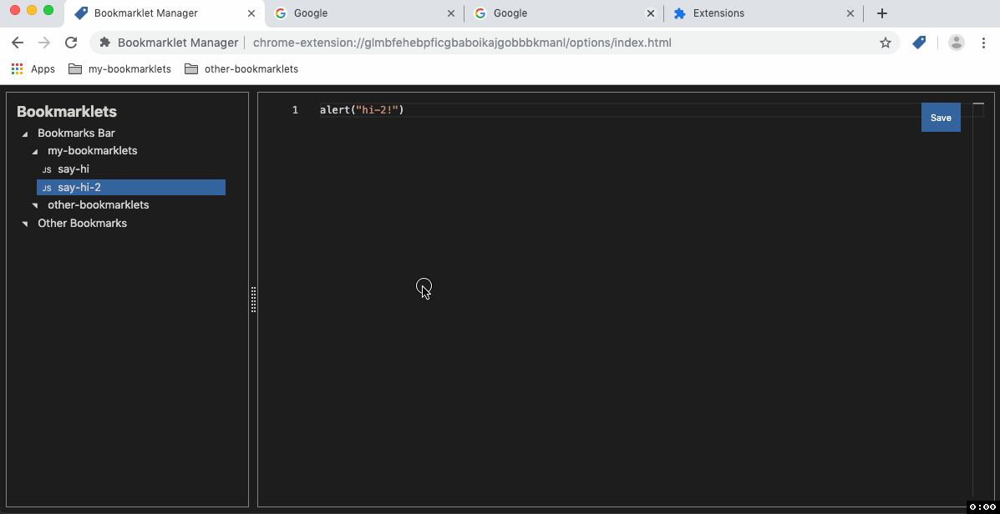

# :bookmark: Chrome Bookmarklet Manager

A chrome extension to edit [bookmarkelts](https://en.wikipedia.org/wiki/Bookmarklet) with the [monaco editor](https://microsoft.github.io/monaco-editor/).

> A bookmarklet is a bookmark stored in a web browser that contains JavaScript commands that add new features to the browser.

## Development

- Clone this repo
- go to `chrome://extensions/`
- enable `Developer mode` slider
- Click `Load unpacked`
- select the `ext` folder from the cloned repo
- run `npm run dev`: will watch source changes and build the Js bundle and put it in the `ext` folder.

